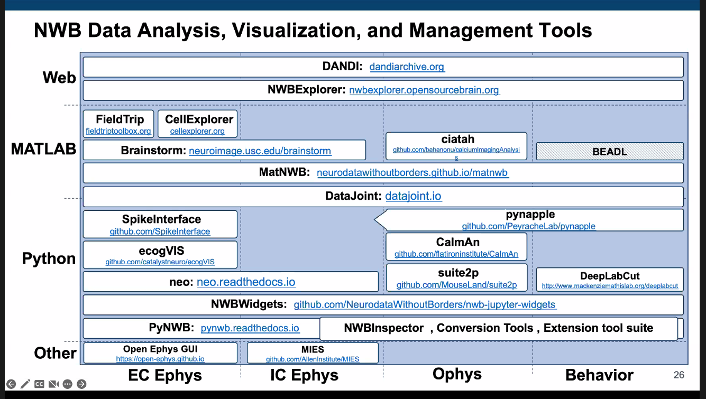

# An open webinar by Allen

This is the open neurodata showcase.

The idea is to change the mindframe from "What new experiment should I design?" to "What query should I run on existing data".
They need help for this and it will be an interative process.

Dandihub is currently free, and works with DataLad.

## MindScope program

Openscope with mindscope - they open up their assets to the community, who can submit experiments (so it acts as an observatory).

## Roundtable on data - reuse

Saskia de Vries, Bing Bruton, Mackenzie Mathis, Colleen Gillon.
Interesting, Colleen Gillon - had a whole chapter on sharing open data. This could actually be really solid for Beth's data if I put in a little bit more time...
Biggest problem - reinventing the wheel - be flexible, and don't make people use the same thing.

Dand seems to have come along a lot also https://www.dandiarchive.org/.