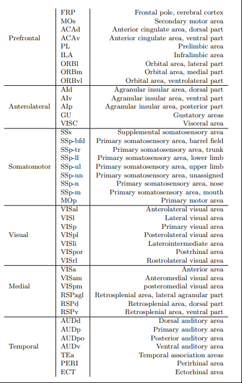

# Connectivity

## Changes to make

1. Check discussion with Shane on last review, but essentially needs some restructuring.
2. Cite this https://www.sciencedirect.com/science/article/pii/S0959438817303161?via%3Dihub#bib0545 (Steinmetz on challenges - mentions studying connected neurons) and the related.
3. This needs to be included https://direct.mit.edu/netn/article/3/1/217/2194/High-resolution-data-driven-model-of-the-mouse (Our model relaxes the assumption of homogeneity of connections within a region and instead assumes smoothness across major brain divisions)

## Papers

Functional organization of the hippocampal longitudinal axis (https://www.nature.com/articles/nrn3785) - this paper mentions how anatomical connectivity varies in parts of the HC differ (may be a reference for when I mention space)

Principles of ipsilateral and contralateral cortico-cortical connectivity in the mouse (https://www.biorxiv.org/content/10.1101/033878v1.full ) - this mentions how “Structural connectivity among cortical areas provides the substrate for information exchange in the brain and is characterized by the presence or absence of connections between specific areas.”. Also “wiring cost reduction design” and the intro well describes why interested in connectivity as it is the anatomical basis of communication. Additionally, it mentions a bit about how the connections act, so might be stepping on it a bit if considering network topology.

Also mentions control analyses, which is something that I may need to consider…
Hierarchical organization of cortical and thalamic connectivity (https://www.nature.com/articles/s41586-019-1716-z) – shows how complex the connectivity is.

Blue brain – I really think I need to mention this. Essentially, they have a recipe for how regions connect (which I need to check further), but it would be this kind of thing which would allow my kind of analysis to function. The idea is, that I am taking a very simplified version of this for illustration purposes.

Spike correlations (Fred Wolf - frontiersin.org/articles/10.3389/fnins.20\11.00068/full) – What is the relation between corr and synchrony (not huge, but it would be along the lines of theoretical tools for spiking activity of multiple neurons (still in infancy) – and ofc this is a very very simple measure. [remember Rob Kass as well]

Linking Connectivity, Dynamics, and Computations in Low-Rank Recurrent Neural Networks (Ostijic - https://www.sciencedirect.com/science/article/pii/S0896627318305439) – this paper is great and will be very useful.
Blue brain - There is a recipe here. It may be difficult, but this is essentially how delta would be determined https://portal.bluebrain.epfl.ch/resources/models/mouse-projections/

This is the paper that states the yield obtained with Npix probes. https://www.ncbi.nlm.nih.gov/pmc/articles/PMC5955206/
Include https://science.sciencemag.org/content/364/6437/eaav3932?ijkey=d478346798245491d75795045d812d749b6d4bdd&keytype2=tf_ipsecsha and https://www.nature.com/articles/s41586-019-1787-x for other Npix probe examples

